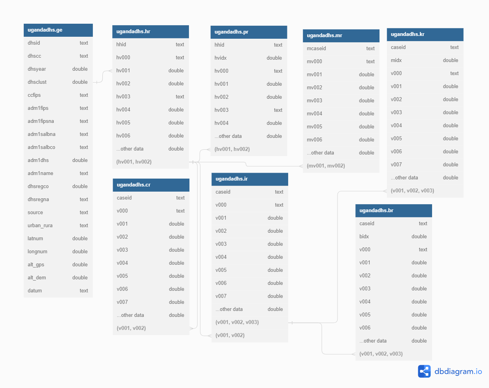

# dhs2db: An R Package for Importing and Linking DHS Data in PostgreSQL

## Introduction

The Demographic and Health Surveys (DHS) program is a valuable source of information for researchers and policymakers working in the fields of public health, demography, and social sciences. It provides nationally representative and cross-sectional data for a wide range of indicators related to population, health, and nutrition. The DHS data are collected through household interviews conducted in numerous countries, usually every five years.

Despite its importance and extensive use, working with DHS data can be challenging due to its complex structure, large size, and the need to link multiple datasets for comprehensive analysis. The dhs2db R package aims to address these challenges by providing a streamlined process to import and link DHS datasets into a PostgreSQL database. This allows researchers to leverage the powerful querying and data manipulation capabilities of PostgreSQL while working with DHS data.

### Justification for the Project

There are several reasons why the development of the dhs2db package may be helpful for researchers working with DHS data:

1. **Data management**: DHS datasets are typically large and can be difficult to manage in memory when using traditional data manipulation tools. Importing the data into a PostgreSQL database allows researchers to perform complex data manipulations and queries more efficiently.

2. **Data linking**: The dhs2db package provides a systematic approach to link various DHS datasets (such as the Household, Individual, and Men's datasets) through their unique identifiers. This makes it easier for researchers to perform multi-level analysis and gain deeper insights into the data.

3. **Data integrity**: By importing the data into a PostgreSQL database, the dhs2db package ensures data integrity through the use of foreign key constraints and unique constraints. This helps prevent errors that may arise from improper data manipulation.

4. **Reproducibility**: Using the dhs2db package ensures that the process of importing and linking DHS data is standardized and reproducible. This is particularly important for researchers who want to share their work and collaborate with others.

5. **Ease of use**: The dhs2db package simplifies the process of importing and linking DHS data, making it accessible to researchers with varying levels of experience in data management and analysis.
git remote add origin https://github.com/jwilliamrozelle/dhs2db.git

## The PostgreSQL database

## Setting up a PostgreSQL database and security considerations

### Installing and setting up PostgreSQL

Before you can use the dhs2db package, you need to have a PostgreSQL database up and running.You can download and install PostgreSQL from the official website: [https://www.postgresql.org/download/](https://www.postgresql.org/download/). After installation, create a new PostgreSQL database using the `createdb` command-line utility or a graphical tool like [pgAdmin](https://www.pgadmin.org/). Ensure that your PostgreSQL server is running and accessible from your R environment. You may need to configure the server's `postgresql.conf` and `pg_hba.conf` files to allow connections from your local machine or remote clients.

### Security considerations

When working with sensitive data, it is crucial to take necessary precautions to secure your PostgreSQL database. Here are some general security practices to follow:

1. **Strong passwords**: Use strong, unique passwords for all database users, including the superuser (postgres) and any application-specific users.

2. **Least privilege principle**: Assign the minimum required privileges to each database user. For example, a user who only needs read access to certain tables should not have write permissions.

3. **Network security**: Restrict access to your PostgreSQL server to trusted IP addresses or networks. Update your `pg_hba.conf` file to only allow connections from specific IP addresses or networks.

4. **Data encryption**: Enable data encryption for data at rest using file system level encryption or PostgreSQL's built-in encryption features. For data in transit, use SSL/TLS to encrypt communication between the PostgreSQL server and clients.

5. **Regular backups**: Schedule regular backups of your PostgreSQL database to protect against data loss due to hardware failure or other issues. Store backups in a secure, offsite location.

6. **Monitoring and auditing**: Monitor your PostgreSQL server for signs of unauthorized access, and set up logging to track user activity within the database.

### Configuring the dhs2db package

After setting up your PostgreSQL database, you can connect to it with the appropriate details. Although the `dhs2pg` function will accept plain text, you may wish to avoid including sensitive information directly in your code - particularly if you use a public repository like github for version control. This tutorial assumes you set the following environment variables:

- `DB_SCHEMA`: The schema name in the PostgreSQL database.
- `DB_HOST`: The hostname or IP address of the PostgreSQL server.
- `DB_PORT`: The port number on which the PostgreSQL server is listening.
- `DB_NAME`: The name of the PostgreSQL database.
- `DB_USER`: The username to use when connecting to the PostgreSQL server.
- `DB_PW`: The password for the user specified in `DB_USER`.

You can set these environment variables in your R environment using the `Sys.setenv()` function, or you can store them in a `.Renviron` file in your project directory. Make sure to protect the `.Renviron` file by setting appropriate file permissions and not including it in your version control system.


```{r, include = FALSE}
knitr::opts_chunk$set(
  collapse = TRUE,
  comment = "#>"
)
```

## Permission and requirements

This package and tutorial assume that you have an account at dhsprogram.com and permission to access datasets.

First install the package using:

```{r eval=FALSE}
devtools::install_github("https://github.com/jwilliamrozelle/dhs2db.git", build_vignettes = T)
```


## Set the environment

First, load the required packages into your R session.

```{r setup}
# library(dhs2db)
library(rdhs)
library(sf)
```


You may wish to keep your personal information outside of your codebase, and `.Renviron` is a good way to accomplish this. Each line in the `.Renviron` file will allow you to set an environment variable (for example, mine has a single line `DHS_EMAIL = <your_email@example.com>`). I use an environment email to store, for example, usernames and passwords and include the `.Renviron` in my `.gitignore` file, so that sensitive information remains on my local computer and is never uploaded to the cloud.

You must restart your R session to load environment variables from the `.Renviron` folder. To follow this tutorial without restarting R, you can set environment variables within the R session by running the following code


```{r eval = FALSE}

Sys.setenv(DHS_EMAIL = "your_email@example.com")
Sys.setenv(DHS_PROJECT = "YOUR DHS PROJECT NAME")


```


## Load the data into R

We will load information into R using the `rdhs` package. For detailed information on retrieving data using `rdhs`, visit the [vignette](https://cran.r-project.org/web/packages/rdhs/vignettes/introduction.html) This package assumes you download data in STATA as zip files. When prompted, type `1` That you would write files outside your R temporary directory, then enter the password for your dhsprogram.com account.

```{r warning=FALSE, eval = F}

# Set up credentials
set_rdhs_config(email = Sys.getenv("DHS_EMAIL"),
                project = Sys.getenv("DHS_PROJECT"),
                config_path = "rdhs.json",
                cache_path = "<your_cache_path>",
                global = F)


# Get DHS surveys
survs <- dhs_surveys(
  countryIds = "UG",
  surveyType = "DHS",
  surveyStatus = "Completed",
  surveyYear = c(2016)
)

# download the datasets
datasets <- dhs_datasets(
  surveyIds = survs$SurveyId, 
  fileFormat = "stata",
  force = TRUE
  )
downloads <- get_datasets(
  datasets$FileName, 
  clear_cache = TRUE)


# make an empty list of dhs data
dhsData.list <- list()

# load each file into R
for (svyTable in names(downloads)) {
  
  # load the downloaded data (sometimes there are weird permissions issues with rDHS. For the sake of this tutorial we will ignore them if they fail)
  try(mySvy <- readRDS(downloads[[svyTable]]))
  
  if (exists("mySvy")) {
    # assign the name of the download
    dhsData.list[[svyTable]] <- mySvy
  }
  
  # remove the generic survey variable from the environment
  rm(mySvy)
}

dhsData.list[["UGGE7AFL"]] <- st_read("<additional_GE_table>")

```


## Send your dhs data to a PostgreSQL database!

The next step is relatively simple using the `dhs2pg` function, although many helper functions in the background make this work. 

* First, the `dhs2pg` creates a schema,
* Drops variables that are duplicated in other datasets (for example, information about place of birth is both in the Individual Recode table and the Birth Recode tables). Then,
* For any tables that are still more than 1600 columns wide, a helper function splits the tables, but retains id columns within each.
* Next, the `dhs2pg` function will upload tables to the PostgreSQL database. Each table is named by the data type (i.e. "ir", "br", etc.).
* Finally, the unique ids and relationships are added as constraints to the tables.

```{r eval = F}

dhs2pg(
  dhs_data_list = dhsData.list,
  schema_name = Sys.getenv("DB_SCHEMA"),
  db_host = Sys.getenv("DB_HOST"),
  db_port = Sys.getenv("DB_PORT"),
  db_name = Sys.getenv("DB_NAME"),
  db_user = Sys.getenv("DB_USER"),
  db_password = Sys.getenv("DB_PW")
  )

```


Output will be:

```default
Creating schema...
Identifying relationships...
Trimming duplicate variables in tables...
Uploading dataframes...
Uploading br...
Uploading cr...
Uploading hr...
Uploading ir...
Uploading kr...
Uploading mr...
Uploading pr...
Uploading ge...
Creating foreign keys...
[1] "Data upload successful. Uploaded tables: br, cr, hr, ir, kr, mr, pr, ge"
```


## ERD

The resulting database organization is:

{width=100%}


